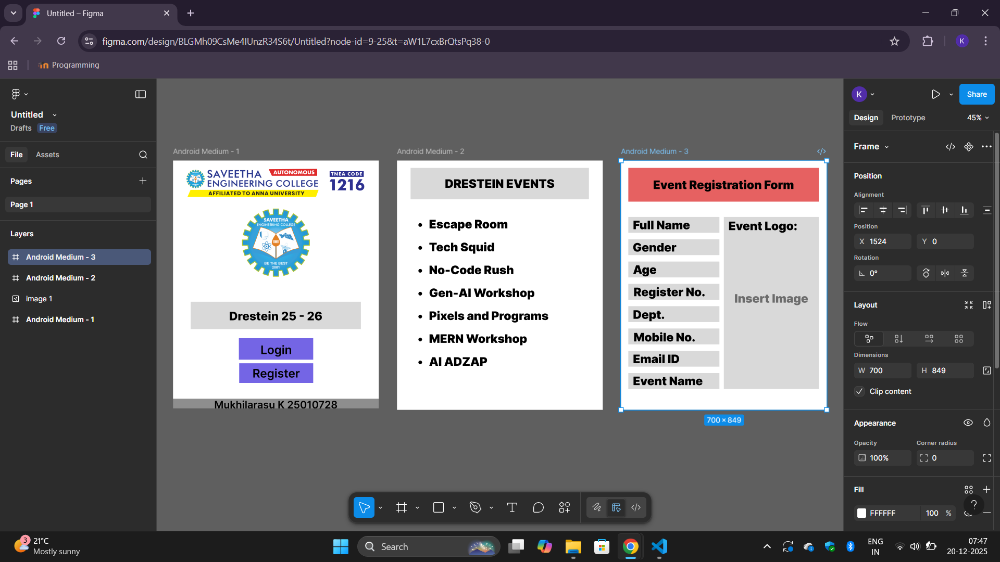

# Ex08 Event Registration Web Application
## Date: 20-12-2025

## AIM:
To design, develop and deploy a web application for event registration using Figma UI tool.

## UI DESIGN TOOL:
Figma

## DESIGN STEPS:

### Step 1:
Use frames to represent screens or sections.

### Step 2:
Add column grids for consistent spacing and alignment.

### Step 3:
Insert shapes, text, buttons, and icons.

### Step 4:
Use Auto Layout for flexible, responsive design.

### Step 5:
Define color, text, and effect styles globally for consistency.

### Step 6:
Name layers logically and group related elements.

### Step 6:
Link frames to show navigation or interactions.

### Step 7:
Select the specific frame while generating code using Anima plugin.

## CODE:
```
Android Medium 1

.android-medium {
  background-color: #ffffff;
  overflow: hidden;
  width: 100%;
  min-width: 700px;
  min-height: 844px;
  position: relative;
}

.android-medium .rectangle {
  position: absolute;
  top: 811px;
  left: 0;
  width: 700px;
  height: 33px;
  background-color: #8d8d8d;
}

.android-medium .image {
  position: absolute;
  top: 157px;
  left: 223px;
  width: 254px;
  height: 245px;
  aspect-ratio: 1.04;
  object-fit: cover;
}

.android-medium .img {
  position: absolute;
  top: 481px;
  left: calc(50.00% - 290px);
  width: 579px;
  height: 93px;
}

.android-medium .text-wrapper {
  position: absolute;
  top: calc(50.00% + 61px);
  left: calc(50.00% - 290px);
  width: 579px;
  height: 93px;
  display: flex;
  align-items: center;
  justify-content: center;
  font-family: "Inter-ExtraBold", Helvetica;
  font-weight: 800;
  color: #000000;
  font-size: 40px;
  text-align: center;
  letter-spacing: 0;
  line-height: normal;
}

.android-medium .text-on-a-path {
  position: absolute;
  top: 610px;
  left: 225px;
  width: 252px;
  height: 68px;
}

.android-medium .rectangle-2 {
  position: absolute;
  top: 690px;
  left: 225px;
  width: 252px;
  height: 67px;
}

.android-medium .div {
  position: absolute;
  top: 691px;
  left: 225px;
  width: 252px;
  height: 67px;
  display: flex;
  align-items: center;
  justify-content: center;
  font-family: "Inter-SemiBold", Helvetica;
  font-weight: 600;
  color: #000000;
  font-size: 40px;
  text-align: center;
  letter-spacing: 0;
  line-height: normal;
}

.android-medium .rectangle-3 {
  position: absolute;
  top: 605px;
  left: 224px;
  width: 253px;
  height: 73px;
  background-color: #7465e5;
}

.android-medium .text-wrapper-2 {
  position: absolute;
  top: 610px;
  left: 225px;
  width: 252px;
  height: 68px;
  display: flex;
  align-items: center;
  justify-content: center;
  font-family: "Inter-SemiBold", Helvetica;
  font-weight: 600;
  color: #000000;
  font-size: 40px;
  text-align: center;
  letter-spacing: 0;
  line-height: normal;
}

.android-medium .text-wrapper-3 {
  position: absolute;
  top: 811px;
  left: 0;
  width: 700px;
  height: 41px;
  display: flex;
  align-items: center;
  justify-content: center;
  font-family: "Inter-SemiBold", Helvetica;
  font-weight: 600;
  color: #000000;
  font-size: 35px;
  text-align: center;
  letter-spacing: 0;
  line-height: normal;
  white-space: nowrap;
}

Android Medium 2

.android-medium {
  background-color: #ffffff;
  width: 100%;
  min-width: 700px;
  min-height: 849px;
  position: relative;
}

.android-medium .rectangle {
  position: absolute;
  top: 25px;
  left: 46px;
  width: 607px;
  height: 107px;
  background-color: #d9d9d9;
}

.android-medium .text-wrapper {
  position: absolute;
  top: 25px;
  left: 46px;
  width: 607px;
  height: 107px;
  display: flex;
  align-items: center;
  justify-content: center;
  font-family: "Inter-Black", Helvetica;
  font-weight: 900;
  color: #000000;
  font-size: 40px;
  text-align: center;
  letter-spacing: 0;
  line-height: normal;
}

.android-medium .escape-room-tech {
  position: absolute;
  top: 192px;
  left: calc(50.00% - 301px);
  width: 602px;
  font-family: "Inter-Black", Helvetica;
  font-weight: 900;
  color: #000000;
  font-size: 40px;
  letter-spacing: 0;
  line-height: normal;
}

Android Medium 3

.android-medium {
  background-color: #ffffff;
  width: 100%;
  min-width: 700px;
  min-height: 849px;
  position: relative;
}

.android-medium .rectangle {
  position: absolute;
  top: 25px;
  left: 25px;
  width: 648px;
  height: 115px;
  background-color: #e66161;
}

.android-medium .text-wrapper {
  position: absolute;
  top: 25px;
  left: 25px;
  width: 648px;
  height: 115px;
  display: flex;
  align-items: center;
  justify-content: center;
  font-family: "Inter-Black", Helvetica;
  font-weight: 900;
  color: #000000;
  font-size: 40px;
  text-align: center;
  letter-spacing: 0;
  line-height: normal;
}

.android-medium .div {
  position: absolute;
  top: 192px;
  left: 25px;
  width: 310px;
  height: 54px;
  background-color: #d9d9d9;
}

.android-medium .rectangle-2 {
  position: absolute;
  top: 420px;
  left: 25px;
  width: 310px;
  height: 54px;
  background-color: #d9d9d9;
}

.android-medium .rectangle-3 {
  position: absolute;
  top: 724px;
  left: 25px;
  width: 310px;
  height: 54px;
  background-color: #d9d9d9;
}

.android-medium .rectangle-4 {
  position: absolute;
  top: 648px;
  left: 25px;
  width: 310px;
  height: 54px;
  background-color: #d9d9d9;
}

.android-medium .rectangle-5 {
  position: absolute;
  top: 572px;
  left: 25px;
  width: 310px;
  height: 54px;
  background-color: #d9d9d9;
}

.android-medium .rectangle-6 {
  position: absolute;
  top: 496px;
  left: 25px;
  width: 310px;
  height: 54px;
  background-color: #d9d9d9;
}

.android-medium .rectangle-7 {
  position: absolute;
  top: 344px;
  left: 25px;
  width: 310px;
  height: 54px;
  background-color: #d9d9d9;
}

.android-medium .full-name {
  position: absolute;
  top: 192px;
  left: 25px;
  width: 310px;
  height: 54px;
  display: flex;
  align-items: center;
  justify-content: center;
  font-family: "Inter-Black", Helvetica;
  font-weight: 900;
  color: #000000;
  font-size: 40px;
  letter-spacing: 0;
  line-height: normal;
}

.android-medium .img {
  position: absolute;
  top: 268px;
  left: 25px;
  width: 310px;
  height: 54px;
}

.android-medium .age {
  position: absolute;
  top: 344px;
  left: 25px;
  width: 310px;
  height: 54px;
  display: flex;
  align-items: center;
  justify-content: center;
  font-family: "Inter-Black", Helvetica;
  font-weight: 900;
  color: #000000;
  font-size: 40px;
  letter-spacing: 0;
  line-height: normal;
}

.android-medium .text-wrapper-2 {
  position: absolute;
  top: 268px;
  left: 40px;
  width: 280px;
  height: 54px;
  display: flex;
  align-items: center;
  justify-content: center;
  font-family: "Inter-Black", Helvetica;
  font-weight: 900;
  color: #000000;
  font-size: 40px;
  letter-spacing: 0;
  line-height: normal;
}

.android-medium .register-no {
  position: absolute;
  top: 420px;
  left: 27px;
  width: 308px;
  height: 54px;
  display: flex;
  align-items: center;
  justify-content: center;
  font-family: "Inter-Black", Helvetica;
  font-weight: 900;
  color: #000000;
  font-size: 40px;
  letter-spacing: 0;
  line-height: normal;
}

.android-medium .dept {
  position: absolute;
  top: 496px;
  left: 25px;
  width: 310px;
  height: 57px;
  display: flex;
  align-items: center;
  justify-content: center;
  font-family: "Inter-Black", Helvetica;
  font-weight: 900;
  color: #000000;
  font-size: 40px;
  letter-spacing: 0;
  line-height: normal;
}

.android-medium .mobile-no {
  position: absolute;
  top: 576px;
  left: 27px;
  width: 293px;
  height: 50px;
  display: flex;
  align-items: center;
  justify-content: center;
  font-family: "Inter-Black", Helvetica;
  font-weight: 900;
  color: #000000;
  font-size: 40px;
  letter-spacing: 0;
  line-height: normal;
}

.android-medium .email-ID {
  position: absolute;
  top: 648px;
  left: 25px;
  width: 310px;
  height: 54px;
  display: flex;
  align-items: center;
  justify-content: center;
  font-family: "Inter-Black", Helvetica;
  font-weight: 900;
  color: #000000;
  font-size: 40px;
  letter-spacing: 0;
  line-height: normal;
}

.android-medium .event-name {
  top: 727px;
  left: 25px;
  width: 310px;
  height: 47px;
  white-space: nowrap;
  position: absolute;
  display: flex;
  align-items: center;
  justify-content: center;
  font-family: "Inter-Black", Helvetica;
  font-weight: 900;
  color: #000000;
  font-size: 40px;
  letter-spacing: 0;
  line-height: normal;
}

.android-medium .rectangle-8 {
  position: absolute;
  top: 192px;
  left: 350px;
  width: 323px;
  height: 586px;
  background-color: #d9d9d9;
}

.android-medium .event-logo {
  top: 192px;
  left: 350px;
  width: 323px;
  height: 61px;
  position: absolute;
  display: flex;
  align-items: center;
  justify-content: center;
  font-family: "Inter-Black", Helvetica;
  font-weight: 900;
  color: #000000;
  font-size: 40px;
  letter-spacing: 0;
  line-height: normal;
}

.android-medium .text-wrapper-3 {
  position: absolute;
  top: 442px;
  left: 350px;
  width: 323px;
  height: 54px;
  display: flex;
  align-items: center;
  justify-content: center;
  opacity: 0.5;
  font-family: "Inter-Black", Helvetica;
  font-weight: 900;
  color: #000000;
  font-size: 40px;
  text-align: center;
  letter-spacing: 0;
  line-height: normal;
}
```

## OUTPUT:


## RESULT:
The program to design, develop and deploy a web application for event registration using Figma UI tool is completed successfully.
